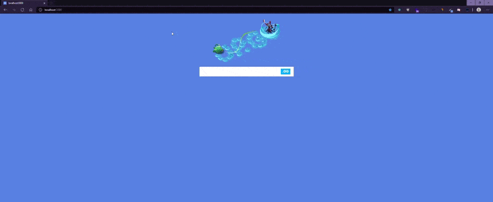

<h1  align="center" > lol-api</h1>

  <a href="#tecnologias">Tecnologias</a>&nbsp;&nbsp;&nbsp;|&nbsp;&nbsp;&nbsp;
  <a href="#-projeto">Projeto</a>&nbsp;&nbsp;&nbsp;

<h1 id="tecnologias"> 🚀 Tecnologias</h1>

Esse projeto foi desenvolvido com as seguintes tecnologias:

- [Next.js](https://nextjs.org/)
- [Express](https://expressjs.com/)
- [Styled Components](https://styled-components.com/)
- [API LOL](https://developer.riotgames.com/)

## 💻 Projeto

Lol-api é um projeto feito para consultar nivel, elo, ultimas partidas e winrate do jogador.  
Após a primeira consulta é gerada uma página estática com next.js
